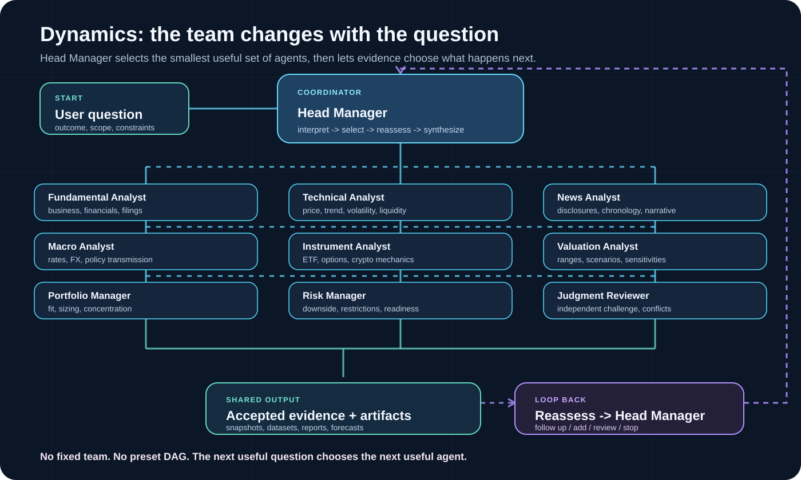
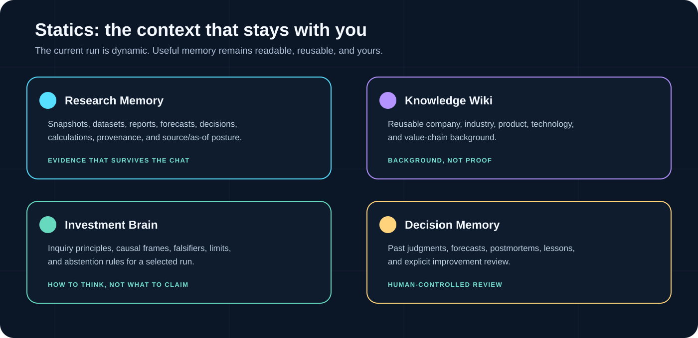

<h1 align="center">TradingCodex: An Evolving Multi-Agent Investment Team for Codex</h1>


<p align="center">
  
</p>

<div align="center">
  <a href="https://pypi.org/project/tradingcodex/"></a>
  <a href="LICENSE"></a>
  
  
</div>

<p align="center">
  <a href="#dynamics">Dynamics</a> ·
  <a href="#statics">Statics</a> ·
  <a href="#install">Install</a> ·
  <a href="https://monarchjuno.github.io/tradingcodex/">User Guide</a>
</p>

TradingCodex brings an evolving investment team into native Codex. Ask a
question in ordinary language; the right agents collaborate, challenge the
evidence, and leave behind reusable context for the next decision.

It is research-first, local-first, and paper-first. A research answer never
becomes a broker action on its own.

## Dynamics

### The team changes with the question

TradingCodex does not send every ticker through the same checklist. Head
Manager reads the mandate, chooses the smallest useful group of agents, runs
independent work in parallel when useful, and revises the team when accepted
evidence exposes a new gap or conflict.

<p align="center">
  
</p>

### The agents

| Agent | What it brings to the team |
| --- | --- |
| **Fundamental Analyst** | Business model, financials, filings, and economics. |
| **Technical Analyst** | Price, trend, momentum, volume, volatility, and liquidity. |
| **News Analyst** | Disclosures, news, chronology, and narrative change. |
| **Macro Analyst** | Rates, FX, commodities, policy, and macro transmission. |
| **Instrument Analyst** | ETF, index, options, crypto, and market-structure mechanics. |
| **Valuation Analyst** | Ranges, scenarios, sensitivities, and valuation gaps. |
| **Portfolio Manager** | Portfolio fit, sizing, concentration, and readiness. |
| **Risk Manager** | Downside, restrictions, risk checks, and approval readiness. |
| **Judgment Reviewer** | Independent challenge of evidence, conflicts, and confidence. |

### The workflow is a loop

```text
question
  -> Head Manager
  -> smallest useful specialist wave
  -> accepted evidence and artifacts
  -> follow up / add a role / request review / synthesize / stop
  -> next question or decision
```

The next agent is chosen by the next useful question, not by a preset research
DAG. A narrow question can stay direct. A high-consequence recommendation can
expand to independent portfolio, risk, and judgment review. There is no
execution agent.

## Statics

### The context that stays with you

The current workflow is dynamic. The useful work it produces is static,
readable, and reusable: files and memory that make the next analysis better
without hiding the evidence inside a chat or silently changing system rules.

<p align="center">
  
</p>

| Static layer | What remains after the run |
| --- | --- |
| **Research Memory** | Source Snapshots, Datasets, reports, forecasts, decisions, calculations, provenance, and evidence gaps. |
| **Knowledge Wiki** | Reusable company, product, technology, industry, and value-chain background. Wiki content is context, not current evidence. |
| **Investment Brain** | Inquiry principles, causal frames, falsifiers, limits, and abstention rules for a selected analysis. |
| **Decision Memory** | Prior judgments, outcomes, postmortems, lessons, and explicit improvement records for future review. |
| **Strategy** | Reusable user-owned decision rules that can shape later research without granting execution authority. |

The workspace stays inspectable and versionable:

```text
trading/
  research/       # snapshots, datasets, artifacts, calculations
  reports/        # research reports and handoffs
  forecasts/      # forward-looking judgments
  decisions/      # decision context and review history
wikis/            # local and active Wiki knowledge
investment-brains/  # user-owned inquiry frameworks
```

Knowledge, Brain, Strategy, and Decision Memory remain distinct. A Wiki does
not become proof, a Brain does not choose agents, and an improvement record does
not silently rewrite prompts, skills, policy, or execution gates.

## Install

For normal use, attach TradingCodex to the folder where you want research to
live. Do not clone this source repository into that workspace.

You need Git, `uvx`, and an installed, authenticated `codex` CLI.

On macOS/Linux:

```bash
cd /path/to/an/empty-workspace
uvx --refresh --from tradingcodex tcx attach . && ./tcx doctor
./tcx service ensure
```

On native Windows PowerShell:

```powershell
cd C:\path\to\an\empty-workspace
uvx --refresh --from tradingcodex tcx attach .
.\tcx.cmd doctor
.\tcx.cmd service ensure
```

After installation, fully restart Codex, reopen and trust the workspace, and
trust every TradingCodex hook when Codex prompts you. If hooks are presented
one at a time, approve each project hook before starting a new task. The viewer
URL is printed by `./tcx service status`; the release default is
`http://127.0.0.1:48267/`. End users do not need Node, npm, or a separate
frontend server.

The Head Manager inherits the active Codex model and reasoning setting. For
full research workflows, we recommend `gpt-5.6-sol` with `high` or `xhigh`
reasoning.

### Start with skills

Start with the skill that matches the work. Each example is a prompt you can
paste into a new Codex task; the [full skill directory](https://monarchjuno.github.io/tradingcodex/skills.html)
has exact invocation rules, boundaries, and deeper examples.

| Skill | Use it for | Example |
| --- | --- | --- |
| [$tcx-plan](https://monarchjuno.github.io/tradingcodex/skill-plan.html) | Frame the outcome, scope, constraints, and stop conditions. | `Clarify a 3-year MSFT quality-compounder mandate. No order.` |
| [$tcx-workflow](https://monarchjuno.github.io/tradingcodex/skill-workflow.html) | Run dynamic research with the smallest useful team. | `Analyze MSFT as a medium-term quality compounder. Include contrary evidence. No order.` |
| [$tcx-memory](https://monarchjuno.github.io/tradingcodex/skill-memory.html) | Replay prior judgment and test whether lessons still hold. | `Review the last MSFT thesis against what was known then.` |
| [$tcx-wiki](https://monarchjuno.github.io/tradingcodex/skill-wiki.html) | Keep reusable company and industry context separate from live evidence. | `Put stable semiconductor value-chain facts from the latest Artifact into the Wiki.` |
| [$tcx-brain](https://monarchjuno.github.io/tradingcodex/skill-brain.html) | Shape inquiry with user-owned heuristics, falsifiers, and limits. | `Create a cautious quality-compounder inquiry framework.` |
| [$tcx-strategy](https://monarchjuno.github.io/tradingcodex/skill-strategy.html) | Turn decision rules into a reusable, reviewable method. | `Define entry, sizing, and invalidation rules for quality compounders.` |

Use the viewer to inspect the resulting Episodes, Library, Wiki, and System
posture. It is read-only; use Codex to continue, narrow, or stop the work.

## The guardrail

Research, Wiki, Brain, Strategy, memory, and automation do not imply broker
authority. Provider connection, ticket drafting, checks, approval, and final
action remain separate checkpoints. Paper is built in; live providers require
their own installation, policy approval, explicit confirmation, sync, and audit
gates.

Raw credentials never belong in prompts, workspace files, reports, API/MCP
responses, artifacts, or audit data.

## Learn more

- [Dynamic workflow](https://monarchjuno.github.io/tradingcodex/dynamic-workflow.html)
  — evidence-driven agent selection, reassessment, and stopping.
- [Knowledge Wiki](https://monarchjuno.github.io/tradingcodex/skill-wiki.html)
  — reusable background knowledge and explicit write boundaries.
- [Investment Brain](https://monarchjuno.github.io/tradingcodex/skill-brain.html)
  — inquiry and interpretation frameworks.
- [Improve](https://monarchjuno.github.io/tradingcodex/improve.html) —
  Decision Memory, postmortems, lessons, and controlled evolution.
- [Installation](installation.md) — updates, runtime homes, service startup,
  and recovery.
- [Safety, policy, and execution](docs/safety-policy-and-execution.md) —
  permissions, approvals, brokers, secrets, and final-action boundaries.
- [Documentation index](docs/README.md) — the complete product reference.

## Developing TradingCodex

This repository is product source, not a user workspace. Start with
[CONTRIBUTING.md](CONTRIBUTING.md), then follow the validation route in
[docs/validation-and-test-plan.md](docs/validation-and-test-plan.md).

## License

TradingCodex is an Apache-2.0 open-core project. See [LICENSE](LICENSE),
[NOTICE](NOTICE), and [TRADEMARKS.md](TRADEMARKS.md).
